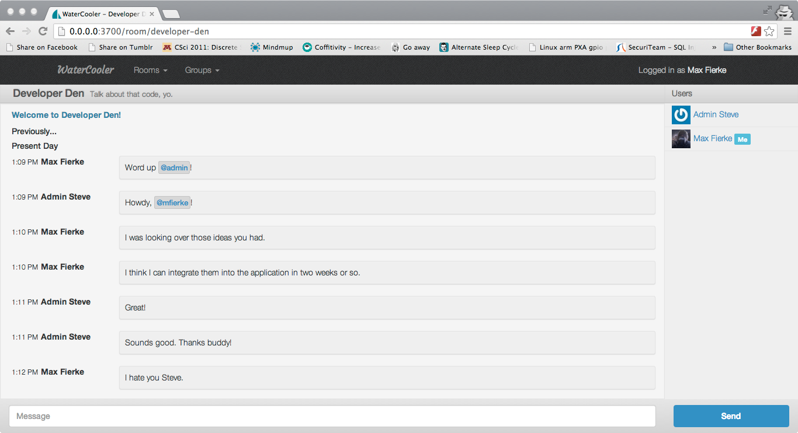

# WaterCooler

## Description
WaterCooler is a free and open-source group chat application designed for use internally within offices and organizations. The intention is to provide a FOSS counterweight to proprietary, SaaS solutions such as Campfire and HipChat, and provide a solution for people looking to host a rich, multi-room chat application behind their firewall on their own hardware.

### Features
* Multple Chat rooms with the option to restrict to certains users and groups.
* Rich, realtime chat functionality
    * Remote image inclusion
    * YouTube & Vimeo link parse-to-details functionality
    * Github integration through PUSH service hook (planned)
* Useable on different screen sizes (responsive)
* Easily deployable to Heroku

## Limitations
There are currently a number of limitations, outside of unimplemented application functionality. There are currently a number of features missing from the Waterline ORM, namely support for association and aggregate functions. As a result, there are a number of inefficent workarounds in-place to emulate this behavior. These usually involve fetching a whole collection and iterating over each entry to filter out entries that don't match the conditions. I'm looking into whether or not it would be worth the effort to switch to Mongoose ODM at the cost of database portability, or whether I should just wait until Waterline catches up.

## Requirements
* Node.js (only tested on 0.10.x)
* MongoDB
* Redis

## Installation
1. Clone the repo
2. Run `$ npm install`
3. Modify config/adapters.js and config/session.js with your MongoDB and Redis info
    * If deploying to Herkou, the application will just use your instance's MongoLab and RedisCloud details.
4. Start the server with `$ node app.js`. It's should now be running on [http://127.0.0.1:3700](http://127.0.0.1:3700) by default.
5. (optional) For YouTube URL parsing, put your YouTube API key in assets/config.json
6. Login with user: `admin` password: `changeme` **and change the password**

## Technologies In Use
* Node.js + Express + Sails.js + Socket.io
* Twitter Bootstrap 3
* jQuery
* MongoDB
* Redis

## Authors
* Max Fierke <max@maxfierke.com>

## License
The MIT License
Copyright © 2013 Max Fierke

Permission is hereby granted, free of charge, to any person obtaining a copy of this software and associated documentation files (the “Software”), to deal in the Software without restriction, including without limitation the rights to use, copy, modify, merge, publish, distribute, sublicense, and/or sell copies of the Software, and to permit persons to whom the Software is furnished to do so, subject to the following conditions:

The above copyright notice and this permission notice shall be included in all copies or substantial portions of the Software.

THE SOFTWARE IS PROVIDED “AS IS”, WITHOUT WARRANTY OF ANY KIND, EXPRESS OR IMPLIED, INCLUDING BUT NOT LIMITED TO THE WARRANTIES OF MERCHANTABILITY, FITNESS FOR A PARTICULAR PURPOSE AND NONINFRINGEMENT. IN NO EVENT SHALL THE AUTHORS OR COPYRIGHT HOLDERS BE LIABLE FOR ANY CLAIM, DAMAGES OR OTHER LIABILITY, WHETHER IN AN ACTION OF CONTRACT, TORT OR OTHERWISE, ARISING FROM, OUT OF OR IN CONNECTION WITH THE SOFTWARE OR THE USE OR OTHER DEALINGS IN THE SOFTWARE.
